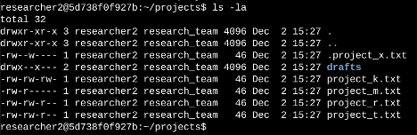
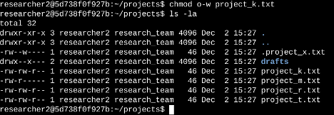
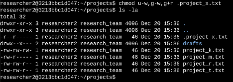
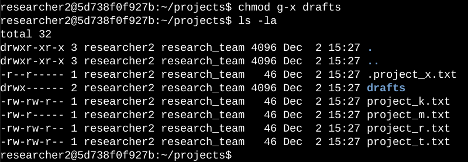

# Lab: Managing File Permissions in Linux

## Project Description

In this exercise, I examined and modified file permissions within a Linux file system to ensure that only authorized users had access to specific files and directories. The task involved reviewing existing permissions, identifying mismatches between current permissions and security policy, and correcting those permissions using Linux commands.

This lab demonstrates practical use of Linux security controls such as file permission inspection, interpreting permission strings, and modifying permissions using the `chmod` command.

---

## Checking File and Directory Permissions

To review the permissions assigned to files and directories, I used the following command:

```bash
ls -la 
```

The ls command lists files and directories.

The -l option displays detailed information including:

- file permissions

- file ownership

- file size

- timestamps

The -a option ensures that hidden files (files beginning with .) are also displayed.

This command allowed me to inspect the contents of the projects directory and review the permissions assigned to each file.

### Command Output



Example output structure:
````bash
-rw-rw-r-- project_t.txt
-rw-rw-r-- project_k.txt
drwxr-xr-x drafts
-r--r--r-- .project_x.txt
````
The first column contains the 10-character permission string, which defines the type of file and the permissions granted to users.

## Understanding the Permission String
Linux permissions are represented by a 10-character string.

Example:
````bash
-rw-rw-r--
````
Each section of the string represents permissions for different users.

Character breakdown

1st character

Indicates the file type:
```bash
- = regular file
d = directory
```
Characters 2–4

Permissions for the owner (user)
```bash
r = read
w = write
x = execute
```
Characters 5–7

Permissions for the group

Characters 8–10

Permissions for others (all other users on the system)

Example interpretation
```bash
-rw-rw-r--
```
This means:
- User: read and write
- Group: read and write
- Others: read only

## Modifying File Permissions

The organization requires that others must not have write access to any project files.

After reviewing the permissions, I identified that project_k.txt required adjustment.

To remove write permission for others, I used:
```bash
chmod o-w project_k.txt
```
Explanation:

- chmod modifies file permissions

- o represents others

- -w removes write permission

After making the change, I verified the update using:

```bash
ls -la
```

### Permission change result




## Updating Permissions for a Hidden File

The file .project_x.txt is a hidden file, which is indicated by the leading period (.).

The research team archived this file and specified that:

- User should have read access

- Group should have read access

- No one should have write permissions

To adjust the permissions, I used:

```bash
chmod u-w,g-w,g+r .project_x.txt
```

Explanation:

- u-w removes write permission from the user

- g-w removes write permission from the group

- g+r ensures the group can read the file

This ensures the file can be viewed but not modified.

### Hidden file permission update




## Restricting Directory Access

The drafts directory should only be accessible by the user researcher2.

To remove execute permissions from the group, I used:
```bash
chmod g-x drafts
```
Explanation:

g-x removes execute permission from the group

Without execute permission, users cannot enter the directory

This ensures only the authorized user can access the directory contents.

### Directory permission update



## Key Skills Demonstrated

-  Inspecting Linux file permissions using ls -la

- Interpreting Linux permission strings

- Managing file permissions using chmod

- Understanding hidden files and directories

- Applying access control principles to protect sensitive data

## Summary

In this exercise, I reviewed existing file permissions within a Linux directory and identified areas where permissions did not align with the organization's security policy. Using the ls -la command, I inspected file permissions and interpreted the 10-character permission string. I then used the chmod command to remove unauthorized write access, adjust permissions for hidden files, and restrict directory access to authorized users.

This process demonstrates how Linux permission controls can be used to enforce proper authorization and strengthen system security.