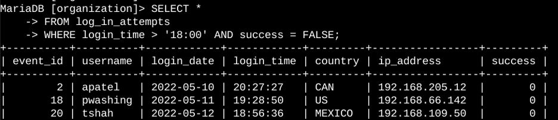
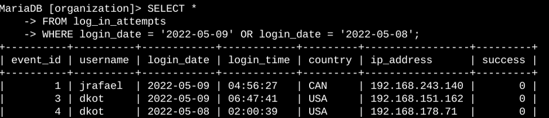
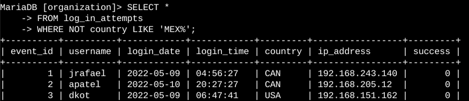
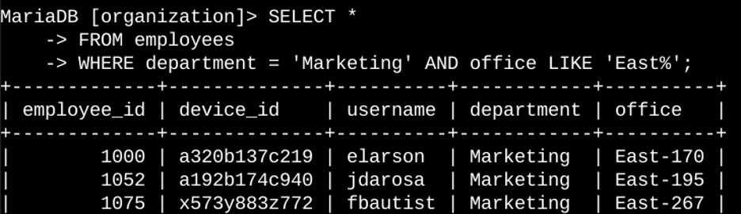
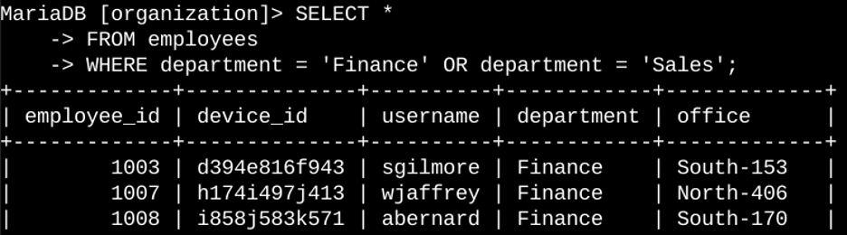
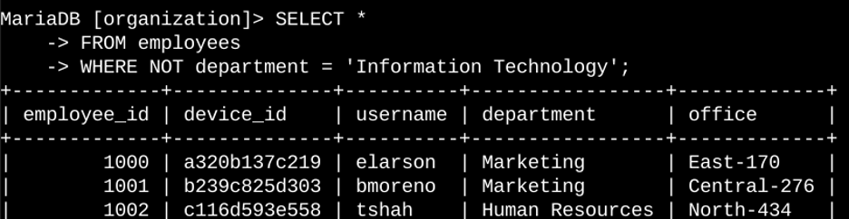

# Lab: Investigating Security Events Using SQL Filters

## Security Context

As part of a routine security investigation, I analyzed authentication logs and employee system data to identify potential security issues. Suspicious login activity was detected in the organization’s authentication records, requiring further investigation to determine whether unauthorized access attempts had occurred..

Using SQL filtering techniques such as `AND`, `OR`, `NOT`, and `LIKE`, I queried two datasets: `log_in_attempts` and `employees`. These queries allowed me to isolate relevant records and support the investigation of potential security incidents.

---

## Retrieve After-Hours Failed Login Attempts

To investigate suspicious activity after business hours, I queried the login activity database to identify failed login attempts that occurred after **18:00**.

```sql
SELECT *
FROM log_in_attempts
WHERE login_time > '18:00' AND success = FALSE;
```



### Explanation

- `SELECT *` retrieves all columns from the dataset.
- `FROM log_in_attempts` specifies the table containing login records.
- `login_time > '18:00'` filters for login attempts made after business hours.
- `success = FALSE` filters for unsuccessful login attempts.
- The `AND` operator ensures both conditions must be satisfied.

This query helps identify potentially suspicious login activity occurring outside normal working hours.

---

## Retrieve Login Attempts on Specific Dates

A suspicious event occurred on **2022-05-09**, so login activity from that day and the day before needed to be reviewed.

```sql
SELECT *
FROM log_in_attempts
WHERE login_date = '2022-05-09'
OR login_date = '2022-05-08';
```



### Explanation

- `login_date` stores the date of each login attempt.
- The `OR` operator returns records matching **either condition**.
- This query retrieves login attempts from both dates to support investigation of the suspicious event.

---

## Retrieve Login Attempts Outside of Mexico

The investigation determined that suspicious activity did **not originate in Mexico**, so login attempts from other countries needed to be examined.

```sql
SELECT *
FROM log_in_attempts
WHERE NOT country LIKE 'MEX%';
```



### Explanation

- The `LIKE` operator searches for patterns in text.
- `'MEX%'` matches values beginning with **MEX**, such as `MEX` or `MEXICO`.
- `%` represents any additional characters following the pattern.
- `NOT` excludes those results.

This query retrieves login attempts originating from countries other than Mexico.

---

## Retrieve Employees in the Marketing Department (East Building)

Security updates needed to be applied to employee machines used by staff in the **Marketing department located in the East building**.

```sql
SELECT *
FROM employees
WHERE department = 'Marketing'
AND office LIKE 'East%';
```



### Explanation

- `department = 'Marketing'` filters employees working in Marketing.
- `office LIKE 'East%'` matches office locations starting with East.
- `%` allows for different office numbers such as `East-170` or `East-320`.
- The `AND` operator ensures both conditions are true.

---

## Retrieve Employees in Finance or Sales

Another update was required for employees working in the **Finance or Sales departments**.

```sql
SELECT *
FROM employees
WHERE department = 'Finance'
OR department = 'Sales';
```



### Explanation

- `department = 'Finance'` filters employees in Finance.
- `department = 'Sales'` filters employees in Sales.
- The `OR` operator returns employees from either department.

---

## Retrieve Employees Not in the IT Department

The final task was to identify employees who were **not part of the Information Technology department**, because they required a different update.

```sql
SELECT *
FROM employees
WHERE NOT department = 'Information Technology';
```



### Explanation

- `NOT` excludes records matching the condition.
- This query returns all employees except those in the IT department.

---

## Key Skills Demonstrated

- Writing SQL queries for security investigations
- Filtering database records using `AND`, `OR`, and `NOT`
- Using `LIKE` and `%` wildcards to match patterns
- Filtering records based on dates and times
- Investigating login activity from authentication logs
- Identifying systems requiring security updates

---

## Summary

In this lab, I used SQL filtering techniques to investigate login activity and identify employee systems that required security updates. By querying the `log_in_attempts` and `employees` tables, I isolated relevant security information using logical operators such as `AND`, `OR`, and `NOT`.

These queries demonstrate how SQL can be used in cybersecurity investigations to analyze authentication logs, detect suspicious activity, and support system maintenance and security updates.